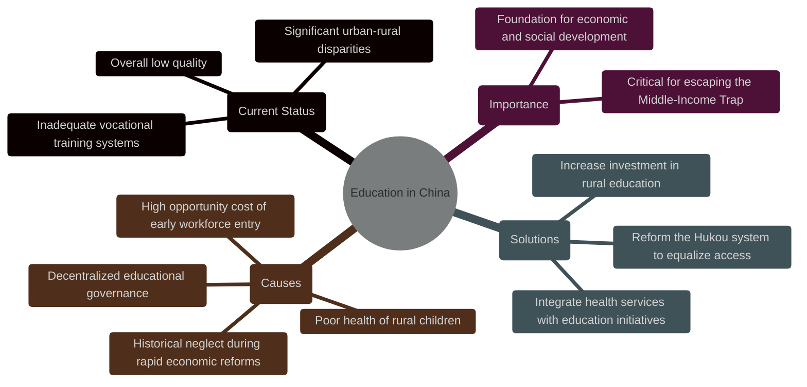

I stumbled upon "Invisible China: How the Urban-Rural Divide Threatens China's Rise" in the economic section of a U.S. bookstore. The cover depicted a farmer in front of urban high-rises, setting a tone I initially mistook for critical. To my surprise, Scott Rozelle and Natalie Hell's work was not a critique but a profound reflection on China's future challenges and opportunities. As someone born and raised in China, the depth and nuance of the issues presented struck me, revealing complexities I had never fully appreciated despite my firsthand experiences.

Here's my review of the book, "Invisible China: How the Urban-Rural Divide Threatens China's Rise" by Scott Rozelle and Natalie Hell.

## Overview
"Invisible China" tackles the vast complexities of China’s socio-economic issues with a sharp focus on an often-overlooked cornerstone: education.

Ray Dalio, in "Principles for Dealing with The Changing World Order," outlines eight crucial indicators of a nation's prosperity or decline: education, competitiveness, technology, military, trade, currency, debt, and leadership. Echoing Charlie Munger's philosophy on the importance of foundational elements, I concur with the author's view that education is pivotal. It serves as the cornerstone for these indicators. When education systems are robust, other areas thrive; conversely, when they falter, the repercussions extend across all sectors, potentially leading to a nation's downfall.

## The Middle-Income Trap - A self-defeating cycle

Rozelle and Hell effectively use the "Chutes and Ladders" game to illustrate the Middle-Income Trap, a critical economic challenge where a country escalates to a certain income level only to stagnate or even regress. Initially, nations like China may climb the economic ladder through inexpensive labor and low production costs, benefiting from ample natural resources. However, as these nations develop, rising wages increase production costs, eroding the competitive edge once gained from their cost-effective labor markets. This phenomenon, not unique to China, reflects a broader global challenge. Despite rapid economic growth—historically over 8% annually, now approximately 5%—China's increasing costs threaten its competitiveness. Learning from regions like South Korea, Japan, Taiwan, and Singapore, the authors highlight education as the pivotal ladder out of this trap, stressing its role in transitioning economies from low-cost labor to high-value, knowledge-driven industries. 

The key? Education.

## Why Education?
While many view China's aging population and declining birth rates as major hurdles for future growth, Japan's experience suggests that demographic challenges do not preclude economic expansion. In reality, the value produced by an economy can far exceed the constraints posed by demographics, especially with a highly educated workforce. Advanced products like ASML's Extreme Ultraviolet (EUV) lithography machines and luxury German cars, which are in high demand despite their high costs, exemplify this. These products rely not on cheap labor but on a sophisticated workforce of scientists, engineers, and designers.

Today, China's achievement in higher education and scientific research are celebrated globally,
with Chinese students prominently featured in top universities worldwide and a growing reputation as a scientific [superpower](https://www.economist.com/science-and-technology/2024/06/12/).

Yet, unbeknownst to the popular opinion in China, and the world, there remains a stark contrast within China itself. The common perception of China's educational prowess overlooks significant systemic failures.

## Where China is failing in Education?
Despite its strides in higher education and research, China confronts significant educational challenges:

- Overall Quality: Many regions, especially rural areas, lag in educational quality compared to urban counterparts.
- Educational Inequality: As of 2022, only 37% of Chinese aged 25-64 have achieved an upper secondary qualification, significantly lower than the OECD average of 83%. This disparity is more pronounced between urban and rural settings.
- Vocational Training Issues: The vocational education system, intended as a bridge to higher skills, often falls short of industry needs and does not adequately replace more comprehensive educational models. A lack of general education in vocational schools set students up for a disconnected job market, where the future students are pepared for industries of the past.

These issues not only perpetuate inequality but also risk stalling China's economic evolution from a middle-income to a high-income nation.

## Why China is failing in Education?
This section of "Invisible China" is particularly insightful as it dissects the educational challenges China faces using multidisciplinary approaches, including historical, economic, psychological, societal, and biological perspectives. This utilization of a comprehensive framework tackles many of the root causes of China's educational woes.

### Historical reasons
First and foremmost, there simply wasn't enough time. Under Deng Xiaoping's great economic reform, China achieved what can only be described as astronomical growth. However, Deng's focus was purely on economic, political and social growth, but not education. This resulted in the average GDP growth significantly surpassing the growth of education. Here lies the great problem of short-termism. China is able to erect a huge city from a tiny village in a matter of years (Shenzhen, Shanghai, etc), entrepreneurs are able to build large factories in a matter of months. However, it takes 18 years before a child can graduate from high school. And the benefit of that child's education may not be realized for another 10 years. 

### Structural reasons
Further complicating this are the decentralized educational systems across provinces, which dilute national focus on education and create disparities in educational quality and opportunity.  Short-term thinking is a great impediment to long-term growth. Why would a provincial governor invest in education, when the benefits of that investment may not be realized until after he has left office? It is much easier to build a bridge or a road, and see the immediate benefits of that investment reflected in next year's provincial GDP growth.

### Economic & Psychological reasons
Another key effect of short-term thinking is the high opportunity cost of education. Economic hypergrowth has also led to a high opportunity cost for education. The abundance of low-skill, well-paying jobs diminishes the perceived value of prolonged education, enticing many to enter the workforce prematurely. What good reason does students have to spend years in school, when they can make a decent living working in a factory? This is a classic case of the tragedy of the commons. The individual benefits from not investing in education, but the society as a whole suffers.

<blockquote class="twitter-tweet">
Bro has 30 years of experience at 20 <a href="https://t.co/mR1dGU6UaR">pic.twitter.com/mR1dGU6UaR</a>
&mdash; internet hall of fame (@InternetH0F) <a href="https://twitter.com/InternetH0F/status/1802332844007592205?ref_src=twsrc%5Etfw">June 16, 2024</a></blockquote>
 

### Societal Reasons
The authors also identified the fundamentally imbalanced social system in China. The Hukou system, which was introduced by Mao Zedong in 1958, greatly exacerbates these disparities by restricting rural citizens' access to the quality education available in urban areas.The primary goal of Hukou system was to control the movement of population and to better manage the allocation of resources. However, that system might have outlived its usefulness for far too long.

### Biological Reasons
Lastly, the authors identified the lack of health as a foundation for education. I grew up in the city, but often enough I also ventured into the rural areas. Yet, without quantitative measurements, the issues the authors identified were also invisible to me. Children in rural China often suffer from anemia, vision problems, intestinal worms, and malnutrition. These health issues are often overlooked, but have a significant impact on a child's ability to learn. From a biological perspective, the rural children are already setup for failure. 

## Consequences of Education Shortfalls?
The consequences of inadequate education systems are profound and multifaceted. Primarily, having only a small elite that is highly educated is insufficient to sustain national growth. Such educational disparities can lead to severe economic inequality, social divisions, and unrest, as evidenced by countries like Mexico, Brazil, and South Africa. These nations demonstrate how a divided society can struggle with high crime rates, low social mobility, and stagnant economic growth.

Moreover, if education fails to keep pace with economic expansion, the cost of production may rise faster than the value generated, eroding China's competitive edge as a major global manufacturer.This imbalance could deplete resources further, exacerbating the challenges in funding an already strained educational system. This will inevitably lead to a self-defeating cycle, where less money is earned, and less money is spent on education, leading to even less money earned.

Historically, China has relied on economic growth and nationalism as pillars of legitimacy. As economic prospects dim, there might be a greater lean on nationalism to maintain social cohesion and stability. However, this shift can heighten domestic and international tensions, posing additional challenges for governance and societal harmony.

## What can China do to fix its education system?
To enhance China's education system, the authors of "Invisible China" suggest several significant reforms aimed at addressing inequalities and improving educational outcomes:

- CCT Policies: Implement Conditional Cash Transfer (CCT) policies to cover hidden costs of education, such as uniforms, books, and transportation, which often prevent low-income families from accessing quality education.

- Increase Rural Funding: Substantially boost funding for rural schools to ensure that these institutions have adequate resources, facilities, and trained teachers, helping to bridge the educational divide between urban and rural areas.

- Introduce quantitative measurements: Implement regular assessments to monitor the health and educational progress of rural children, enabling the government to identify and address structural issues that impede learning.

- Reform the Hukou System: Advocate for the abolition of the Hukou system, or at least reform it to a more centralized education system that does not discriminate based on one's registered domicile. This would allow more equitable access to educational and social services across regions.

- Focus on Health: Emphasize the health of young children as foundational to educational success by implementing programs aimed at improving nutrition, treating common ailments like anemia and intestinal worms, and conducting regular health and vision screenings.

- Support for All Children: End the phenomenon of "left-behind children" by creating more inclusive policies that integrate these children into the educational system, ensuring they receive the same attention and resources as their urban counterparts.

## My Hope for China
Having witnessed firsthand the swift pace of China's growth and its ramifications, I understand the complexities involved in overhauling an education system entrenched in short-term goals. While the concept of investing in education may seem straightforward, it demands a vision that spans generations—a challenge that is not unique to China but perhaps more acute given its rapid development. Inspired by Marxist principles that underscore China's governance, "quantitative change leads to qualitative change," I remain hopeful. With deliberate patience and enduring commitment, China can indeed surpass the middle-income trap, once and for all.

